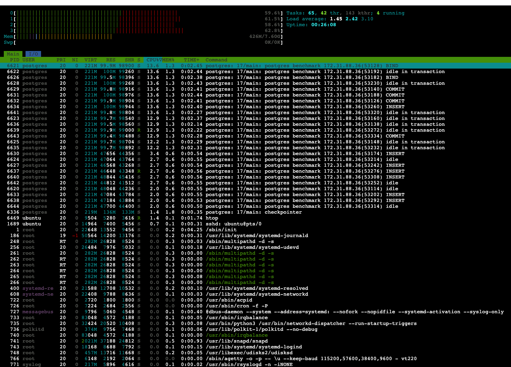
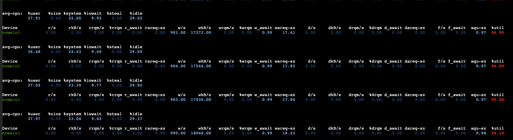

# Two 15-minute runs

- ✍️ **write:** 2.82 MiB/s (2,885 msg/s)
- 📖️ **read:** 2.82 MiB/s (2,885 msg/s)
- **CPU:** ~60%
- write latency:
  - p99: 2.46 ms
  - p95: 2.27 ms
  - p50: 1.77 ms
- read latency:
  - p99: 4.20 ms
  - p95: 3.64 ms
  - p50: 3.37 ms
- end-to-end latency:
  - p99: 15.86 ms
  - p95: 5.74 ms
  - p50: 5.07 ms
- bottleneck: number of clients; more clients raises CPU; this number of clients can't push more throughput.


```bash
ubuntu@ip-172-31-79-187:/tmp/postgres-queue-benchmarks$ ./pg_msg_bench   --host=$HOST   --port=5432   --db=benchmark \
  --user=postgres   --password=postgres   --writers=10   --readers=15   --duration=1800s   --payload=1024 \
  --report=30s   --throttle_writes=2900   --mode=queue
```

### htop snapshot



-----

### iostat snapshot


-----

# Run 1
```bash
ubuntu@ip-172-31-79-187:/tmp/postgres-queue-benchmarks$ ./pg_msg_bench   --host=$HOST   --port=5432   --db=benchmark   --user=postgres   --password=postgres   --writers=10   --readers=15   --duration=1800s   --payload=1024   --report=30s   --throttle_writes=2900   --mode=queue
[08:18:19] W: 2996/s R: 2995/s QDepth: 8 Err(W/R): 0/0
[08:18:49] W: 2900/s R: 2900/s QDepth: 11 Err(W/R): 0/0
[08:19:19] W: 2900/s R: 2900/s QDepth: 12 Err(W/R): 0/0
[08:19:49] W: 2900/s R: 2900/s QDepth: 10 Err(W/R): 0/0
[08:20:19] W: 2900/s R: 2900/s QDepth: 8 Err(W/R): 0/0
[08:20:49] W: 2900/s R: 2900/s QDepth: 9 Err(W/R): 0/0
[08:21:19] W: 2900/s R: 2900/s QDepth: 9 Err(W/R): 0/0
[08:21:49] W: 2900/s R: 2900/s QDepth: 9 Err(W/R): 0/0
[08:22:19] W: 2900/s R: 2900/s QDepth: 10 Err(W/R): 0/0
[08:22:49] W: 2900/s R: 2900/s QDepth: 6 Err(W/R): 0/0
[08:23:19] W: 2900/s R: 2900/s QDepth: 9 Err(W/R): 0/0
[08:23:49] W: 2900/s R: 2900/s QDepth: 9 Err(W/R): 0/0
[08:24:19] W: 2900/s R: 2900/s QDepth: 12 Err(W/R): 0/0
[08:24:49] W: 2900/s R: 2900/s QDepth: 12 Err(W/R): 0/0
[08:25:19] W: 2848/s R: 2848/s QDepth: 9 Err(W/R): 0/0
[08:25:49] W: 2900/s R: 2900/s QDepth: 11 Err(W/R): 0/0
[08:26:19] W: 2900/s R: 2900/s QDepth: 12 Err(W/R): 0/0
[08:26:49] W: 2900/s R: 2900/s QDepth: 7 Err(W/R): 0/0
[08:27:19] W: 2788/s R: 2786/s QDepth: 58 Err(W/R): 0/0
[08:27:49] W: 2903/s R: 2905/s QDepth: 11 Err(W/R): 0/0
[08:28:19] W: 2900/s R: 2900/s QDepth: 14 Err(W/R): 0/0
[08:28:49] W: 2900/s R: 2900/s QDepth: 9 Err(W/R): 0/0
[08:29:19] W: 2900/s R: 2900/s QDepth: 12 Err(W/R): 0/0
[08:29:49] W: 2900/s R: 2900/s QDepth: 8 Err(W/R): 0/0
[08:30:19] W: 2900/s R: 2900/s QDepth: 12 Err(W/R): 0/0
[08:30:49] W: 2664/s R: 2665/s QDepth: 9 Err(W/R): 0/0
[08:31:19] W: 2900/s R: 2900/s QDepth: 9 Err(W/R): 0/0
[08:31:49] W: 2900/s R: 2900/s QDepth: 9 Err(W/R): 0/0
[08:32:19] W: 2900/s R: 2900/s QDepth: 9 Err(W/R): 0/0
[08:32:49] W: 2900/s R: 2900/s QDepth: 9 Err(W/R): 0/0
[08:33:19] W: 2900/s R: 2900/s QDepth: 9 Err(W/R): 0/0
[08:33:49] W: 2696/s R: 2696/s QDepth: 9 Err(W/R): 0/0
[08:34:19] W: 2900/s R: 2900/s QDepth: 9 Err(W/R): 0/0
[08:34:49] W: 2900/s R: 2900/s QDepth: 9 Err(W/R): 0/0
[08:35:19] W: 2900/s R: 2900/s QDepth: 10 Err(W/R): 0/0
[08:35:49] W: 2900/s R: 2900/s QDepth: 11 Err(W/R): 0/0
[08:36:19] W: 2900/s R: 2900/s QDepth: 9 Err(W/R): 0/0
[08:36:49] W: 2900/s R: 2900/s QDepth: 12 Err(W/R): 0/0
[08:37:19] W: 2733/s R: 2731/s QDepth: 76 Err(W/R): 0/0
[08:37:49] W: 2924/s R: 2927/s QDepth: 6 Err(W/R): 0/0
[08:38:19] W: 2830/s R: 2830/s QDepth: 11 Err(W/R): 0/0
[08:38:49] W: 2900/s R: 2900/s QDepth: 7 Err(W/R): 0/0
[08:39:19] W: 2900/s R: 2900/s QDepth: 9 Err(W/R): 0/0
[08:39:49] W: 2900/s R: 2900/s QDepth: 9 Err(W/R): 0/0
[08:40:19] W: 2900/s R: 2900/s QDepth: 12 Err(W/R): 0/0
[08:40:49] W: 2900/s R: 2900/s QDepth: 11 Err(W/R): 0/0
[08:41:19] W: 2900/s R: 2900/s QDepth: 9 Err(W/R): 0/0
[08:41:49] W: 2900/s R: 2900/s QDepth: 6 Err(W/R): 0/0
[08:42:19] W: 2886/s R: 2886/s QDepth: 12 Err(W/R): 0/0
[08:42:49] W: 2900/s R: 2900/s QDepth: 9 Err(W/R): 0/0
[08:43:19] W: 2689/s R: 2689/s QDepth: 9 Err(W/R): 0/0
[08:43:49] W: 2900/s R: 2900/s QDepth: 12 Err(W/R): 0/0
[08:44:19] W: 2900/s R: 2900/s QDepth: 12 Err(W/R): 0/0
[08:44:49] W: 2900/s R: 2900/s QDepth: 10 Err(W/R): 0/0
[08:45:19] W: 2900/s R: 2900/s QDepth: 12 Err(W/R): 0/0
[08:45:49] W: 2900/s R: 2900/s QDepth: 7 Err(W/R): 0/0
[08:46:19] W: 2900/s R: 2900/s QDepth: 9 Err(W/R): 0/0
[08:46:49] W: 2900/s R: 2900/s QDepth: 9 Err(W/R): 0/0
[08:47:19] W: 2900/s R: 2900/s QDepth: 11 Err(W/R): 0/0

=== Summary ===
Total Writes: 5191756
Total Reads: 5191748
Total Updates: 5191748
Write Errors: 0
Read Errors: 2
Avg Write Throughput: 2884.31 rows/sec
Avg Read Throughput: 2884.30 rows/sec

Write Latencies (INSERT only):
  P50: 1.766399ms
  P95: 2.267135ms
  P99: 2.463743ms

Read Latencies (txn: SELECT+DELETE+INSERT):
  P50: 3.364863ms
  P95: 3.637247ms
  P99: 4.186111ms

End-to-End Latencies (created_at → consumed):
  P50: 5.066751ms
  P95: 5.738495ms
  P99: 14.000127ms

2025/10/04 08:47:49 queue benchmark complete
```

# Run 2
```bash
ubuntu@ip-172-31-79-187:/tmp/postgres-queue-benchmarks$ ./pg_msg_bench   --host=$HOST   --port=5432   --db=benchmark   --user=postgres   --password=postgres   --writers=10   --readers=15   --duration=1800s   --payload=1024   --report=30s   --throttle_writes=2900   --mode=queue
[08:51:03] W: 2995/s R: 2995/s QDepth: 11 Err(W/R): 0/0
[08:51:33] W: 2900/s R: 2900/s QDepth: 11 Err(W/R): 0/0
[08:52:03] W: 2900/s R: 2900/s QDepth: 11 Err(W/R): 0/0
[08:52:33] W: 2900/s R: 2900/s QDepth: 9 Err(W/R): 0/0
[08:53:03] W: 2900/s R: 2900/s QDepth: 8 Err(W/R): 0/0
[08:53:33] W: 2900/s R: 2900/s QDepth: 8 Err(W/R): 0/0
[08:54:03] W: 2900/s R: 2900/s QDepth: 13 Err(W/R): 0/0
[08:54:33] W: 2900/s R: 2900/s QDepth: 6 Err(W/R): 0/0
[08:55:03] W: 2900/s R: 2900/s QDepth: 13 Err(W/R): 0/0
[08:55:33] W: 2900/s R: 2900/s QDepth: 9 Err(W/R): 0/0
[08:56:03] W: 2900/s R: 2900/s QDepth: 9 Err(W/R): 0/0
[08:56:33] W: 2900/s R: 2900/s QDepth: 9 Err(W/R): 0/0
[08:57:03] W: 2900/s R: 2900/s QDepth: 10 Err(W/R): 0/0
[08:57:33] W: 2900/s R: 2900/s QDepth: 9 Err(W/R): 0/0
[08:58:03] W: 2900/s R: 2900/s QDepth: 9 Err(W/R): 0/0
[08:58:33] W: 2804/s R: 2804/s QDepth: 10 Err(W/R): 0/0
[08:59:03] W: 2900/s R: 2900/s QDepth: 9 Err(W/R): 0/0
[08:59:33] W: 2900/s R: 2900/s QDepth: 8 Err(W/R): 0/0
[09:00:03] W: 2900/s R: 2900/s QDepth: 12 Err(W/R): 0/0
[09:00:33] W: 2759/s R: 2756/s QDepth: 114 Err(W/R): 0/0
[09:01:03] W: 2947/s R: 2951/s QDepth: 8 Err(W/R): 0/0
[09:01:33] W: 2900/s R: 2900/s QDepth: 7 Err(W/R): 0/0
[09:02:03] W: 2900/s R: 2900/s QDepth: 7 Err(W/R): 0/0
[09:02:33] W: 2900/s R: 2900/s QDepth: 9 Err(W/R): 0/0
[09:03:03] W: 2900/s R: 2900/s QDepth: 8 Err(W/R): 0/0
[09:03:33] W: 2683/s R: 2683/s QDepth: 10 Err(W/R): 0/0
[09:04:03] W: 2900/s R: 2900/s QDepth: 7 Err(W/R): 0/0
[09:04:33] W: 2900/s R: 2900/s QDepth: 9 Err(W/R): 0/0
[09:05:03] W: 2900/s R: 2900/s QDepth: 9 Err(W/R): 0/0
[09:05:33] W: 2900/s R: 2900/s QDepth: 8 Err(W/R): 0/0
[09:06:03] W: 2900/s R: 2900/s QDepth: 9 Err(W/R): 0/0
[09:06:33] W: 2900/s R: 2900/s QDepth: 9 Err(W/R): 0/0
[09:07:03] W: 2900/s R: 2900/s QDepth: 8 Err(W/R): 0/0
[09:07:33] W: 2846/s R: 2846/s QDepth: 12 Err(W/R): 0/0
[09:08:03] W: 2900/s R: 2900/s QDepth: 11 Err(W/R): 0/0
[09:08:33] W: 2900/s R: 2900/s QDepth: 10 Err(W/R): 0/0
[09:09:03] W: 2900/s R: 2900/s QDepth: 9 Err(W/R): 0/0
[09:09:33] W: 2900/s R: 2900/s QDepth: 9 Err(W/R): 0/0
[09:10:03] W: 2900/s R: 2900/s QDepth: 6 Err(W/R): 0/0
[09:10:33] W: 2900/s R: 2900/s QDepth: 7 Err(W/R): 0/0
[09:11:03] W: 2900/s R: 2900/s QDepth: 11 Err(W/R): 0/0
[09:11:33] W: 2900/s R: 2900/s QDepth: 9 Err(W/R): 0/0
[09:12:03] W: 2900/s R: 2900/s QDepth: 12 Err(W/R): 0/0
[09:12:33] W: 2900/s R: 2900/s QDepth: 12 Err(W/R): 0/0
[09:13:03] W: 2900/s R: 2900/s QDepth: 10 Err(W/R): 0/0
[09:13:33] W: 2679/s R: 2679/s QDepth: 9 Err(W/R): 0/0
[09:14:03] W: 2900/s R: 2900/s QDepth: 8 Err(W/R): 0/0
[09:14:33] W: 2900/s R: 2900/s QDepth: 9 Err(W/R): 0/0
[09:15:03] W: 2900/s R: 2900/s QDepth: 9 Err(W/R): 0/0
[09:15:33] W: 2900/s R: 2900/s QDepth: 12 Err(W/R): 0/0
[09:16:03] W: 2900/s R: 2900/s QDepth: 9 Err(W/R): 0/0
[09:16:33] W: 2900/s R: 2900/s QDepth: 9 Err(W/R): 0/0
[09:17:03] W: 2900/s R: 2900/s QDepth: 9 Err(W/R): 0/0
[09:17:33] W: 2900/s R: 2900/s QDepth: 12 Err(W/R): 0/0
[09:18:03] W: 2900/s R: 2900/s QDepth: 6 Err(W/R): 0/0
[09:18:33] W: 2782/s R: 2782/s QDepth: 8 Err(W/R): 0/0
[09:19:03] W: 2751/s R: 2751/s QDepth: 12 Err(W/R): 0/0
[09:19:33] W: 2900/s R: 2900/s QDepth: 9 Err(W/R): 0/0
[09:20:03] W: 2900/s R: 2900/s QDepth: 12 Err(W/R): 0/0

=== Summary ===
Total Writes: 5194388
Total Reads: 5194380
Total Updates: 5194380
Write Errors: 0
Read Errors: 3
Avg Write Throughput: 2885.77 rows/sec
Avg Read Throughput: 2885.77 rows/sec

Write Latencies (INSERT only):
  P50: 1.770495ms
  P95: 2.271231ms
  P99: 2.461695ms

Read Latencies (txn: SELECT+DELETE+INSERT):
  P50: 3.368959ms
  P95: 3.645439ms
  P99: 4.206591ms

End-to-End Latencies (created_at → consumed):
  P50: 5.074943ms
  P95: 5.738495ms
  P99: 17.727487ms

2025/10/04 09:20:33 queue benchmark complete
```
