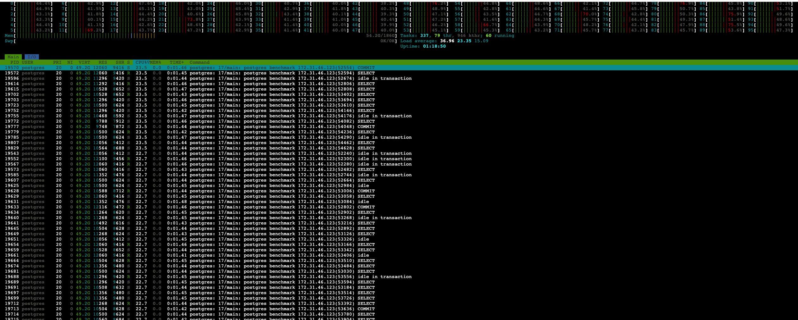
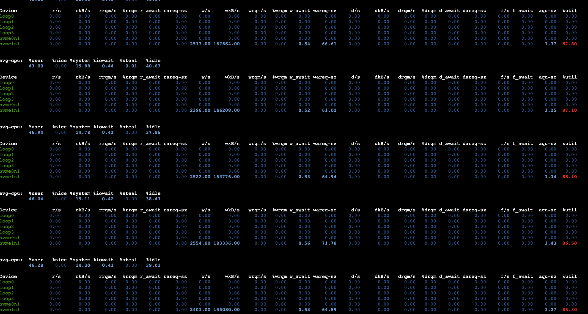
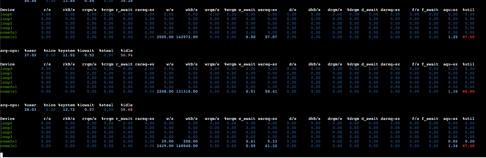

# About





# Run 1
```bash
ubuntu@ip-172-31-46-123:/tmp/postgres-queue-benchmarks$ ./pg_msg_bench   --host=$HOST   --port=5432   --db=benchmark   --user=postgres   --password=postgres   --writers=100   --readers=200   --duration=120s   --payload=1024   --report=5s  --throttle_writes=20000 --mode=queue --tune-table-vacuum
2025/10/03 18:40:22 [queue info] applied aggressive autovacuum/fillfactor tuning to queue table
[18:40:27] W: 23982/s R: 20657/s QDepth: 16622 Err(W/R): 0/0
[18:40:32] W: 19978/s R: 20796/s QDepth: 12533 Err(W/R): 0/0
[18:40:37] W: 20031/s R: 22072/s QDepth: 2329 Err(W/R): 0/0
[18:40:42] W: 20014/s R: 20431/s QDepth: 242 Err(W/R): 0/0
[18:40:47] W: 20066/s R: 20036/s QDepth: 392 Err(W/R): 0/0
[18:40:52] W: 20020/s R: 20057/s QDepth: 207 Err(W/R): 0/0
[18:40:57] W: 20014/s R: 20036/s QDepth: 97 Err(W/R): 0/0
[18:41:02] W: 20020/s R: 20003/s QDepth: 179 Err(W/R): 0/0
[18:41:07] W: 20023/s R: 20042/s QDepth: 83 Err(W/R): 0/0
[18:41:12] W: 20025/s R: 19768/s QDepth: 1366 Err(W/R): 0/0
[18:41:17] W: 20016/s R: 20271/s QDepth: 89 Err(W/R): 0/0
[18:41:22] W: 20018/s R: 20018/s QDepth: 91 Err(W/R): 0/0
[18:41:27] W: 20020/s R: 20016/s QDepth: 111 Err(W/R): 0/0
[18:41:32] W: 20015/s R: 20003/s QDepth: 175 Err(W/R): 0/0
[18:41:37] W: 20021/s R: 20035/s QDepth: 106 Err(W/R): 0/0
[18:41:42] W: 20020/s R: 20025/s QDepth: 85 Err(W/R): 0/0
[18:41:47] W: 20017/s R: 20017/s QDepth: 87 Err(W/R): 0/0
[18:41:52] W: 20016/s R: 20014/s QDepth: 97 Err(W/R): 0/0
[18:41:57] W: 20018/s R: 20020/s QDepth: 89 Err(W/R): 0/0
[18:42:02] W: 20019/s R: 19951/s QDepth: 425 Err(W/R): 0/0
[18:42:07] W: 20014/s R: 20043/s QDepth: 284 Err(W/R): 0/0
[18:42:12] W: 20019/s R: 20013/s QDepth: 313 Err(W/R): 0/0
[18:42:17] W: 20021/s R: 19994/s QDepth: 447 Err(W/R): 0/0

=== Summary ===
Total Writes: 2419524
Total Reads: 2419428
Total Updates: 2419428
Write Errors: 0
Read Errors: 24
Avg Write Throughput: 20162.70 rows/sec
Avg Read Throughput: 20161.90 rows/sec

Write Latencies (INSERT only):
  P50: 1.162239ms
  P95: 1.989631ms
  P99: 9.469951ms

Read Latencies (txn: SELECT+DELETE+INSERT in queue; txn: UPDATE+SELECT range in pub-sub kafka semantics):
  P50: 6.279167ms
  P95: 15.024127ms
  P99: 22.790143ms

End-to-End Latencies (created_at → consumed):
  P50: 12.591103ms
  P95: 762.839039ms
  P99: 947.912703ms

2025/10/03 18:42:22 queue benchmark complete
ubuntu@ip-172-31-46-123:/tmp/postgres-queue-benchmarks$ 
```

# Run 2

```bash
ubuntu@ip-172-31-46-123:/tmp/postgres-queue-benchmarks$ ./pg_msg_bench   --host=$HOST   --port=5432   --db=benchmark   --user=postgres   --password=postgres   --writers=100   --readers=200   --duration=120s   --payload=1024   --report=5s  --throttle_writes=20000 --mode=queue --tune-table-vacuum
2025/10/03 18:42:37 [queue info] applied aggressive autovacuum/fillfactor tuning to queue table
[18:42:42] W: 23991/s R: 21125/s QDepth: 14333 Err(W/R): 0/0
[18:42:47] W: 20017/s R: 21479/s QDepth: 7024 Err(W/R): 0/0
[18:42:52] W: 20012/s R: 21071/s QDepth: 1729 Err(W/R): 0/0
[18:42:57] W: 20018/s R: 20171/s QDepth: 963 Err(W/R): 0/0
[18:43:02] W: 20014/s R: 20162/s QDepth: 221 Err(W/R): 0/0
[18:43:07] W: 20011/s R: 20020/s QDepth: 176 Err(W/R): 0/0
[18:43:12] W: 20013/s R: 20021/s QDepth: 137 Err(W/R): 0/0
[18:43:17] W: 20023/s R: 20035/s QDepth: 77 Err(W/R): 0/0
[18:43:22] W: 20011/s R: 19919/s QDepth: 538 Err(W/R): 0/0
[18:43:27] W: 20017/s R: 20107/s QDepth: 85 Err(W/R): 0/0
[18:43:32] W: 20016/s R: 20001/s QDepth: 160 Err(W/R): 0/0
[18:43:37] W: 20014/s R: 20023/s QDepth: 114 Err(W/R): 0/0
[18:43:42] W: 20022/s R: 19981/s QDepth: 317 Err(W/R): 0/0
[18:43:47] W: 20015/s R: 20026/s QDepth: 266 Err(W/R): 0/0
[18:43:52] W: 20012/s R: 20003/s QDepth: 309 Err(W/R): 0/0
[18:43:57] W: 20017/s R: 20053/s QDepth: 129 Err(W/R): 0/0
[18:44:02] W: 20016/s R: 20023/s QDepth: 91 Err(W/R): 0/0
[18:44:07] W: 20021/s R: 20023/s QDepth: 84 Err(W/R): 0/0
[18:44:12] W: 20017/s R: 20013/s QDepth: 107 Err(W/R): 0/0
[18:44:17] W: 20013/s R: 19973/s QDepth: 308 Err(W/R): 0/0
[18:44:22] W: 20016/s R: 20051/s QDepth: 136 Err(W/R): 0/0
[18:44:27] W: 20014/s R: 19650/s QDepth: 1955 Err(W/R): 0/0
[18:44:32] W: 20020/s R: 20358/s QDepth: 264 Err(W/R): 0/0

=== Summary ===
Total Writes: 2416203
Total Reads: 2415524
Total Updates: 2415524
Write Errors: 0
Read Errors: 36
Avg Write Throughput: 20135.03 rows/sec
Avg Read Throughput: 20129.37 rows/sec

Write Latencies (INSERT only):
  P50: 1.160191ms
  P95: 2.030591ms
  P99: 9.502719ms

Read Latencies (txn: SELECT+DELETE+INSERT in queue; txn: UPDATE+SELECT range in pub-sub kafka semantics):
  P50: 6.307839ms
  P95: 14.999551ms
  P99: 22.478847ms

End-to-End Latencies (created_at → consumed):
  P50: 13.205503ms
  P95: 593.494015ms
  P99: 898.629631ms

2025/10/03 18:44:37 queue benchmark complete
```

# Run 3

```bash
ubuntu@ip-172-31-46-123:/tmp/postgres-queue-benchmarks$ ./pg_msg_bench   --host=$HOST   --port=5432   --db=benchmark   --user=postgres   --password=postgres   --writers=100   --readers=200   --duration=120s   --payload=1024   --report=5s  --throttle_writes=20000 --mode=queue --tune-table-vacuum
2025/10/03 18:44:52 [queue info] applied aggressive autovacuum/fillfactor tuning to queue table
[18:44:57] W: 23980/s R: 20712/s QDepth: 16339 Err(W/R): 0/0
[18:45:02] W: 20013/s R: 20542/s QDepth: 13695 Err(W/R): 0/0
[18:45:07] W: 20023/s R: 21714/s QDepth: 5241 Err(W/R): 0/0
[18:45:12] W: 20014/s R: 21030/s QDepth: 161 Err(W/R): 0/0
[18:45:17] W: 20018/s R: 20022/s QDepth: 141 Err(W/R): 0/0
[18:45:22] W: 20017/s R: 20011/s QDepth: 169 Err(W/R): 0/0
[18:45:27] W: 20013/s R: 20031/s QDepth: 80 Err(W/R): 0/0
[18:45:32] W: 20016/s R: 20013/s QDepth: 98 Err(W/R): 0/0
[18:45:37] W: 20016/s R: 19979/s QDepth: 282 Err(W/R): 0/0
[18:45:42] W: 20018/s R: 20057/s QDepth: 90 Err(W/R): 0/0
[18:45:47] W: 20017/s R: 19996/s QDepth: 196 Err(W/R): 0/0
[18:45:52] W: 20013/s R: 20009/s QDepth: 215 Err(W/R): 0/0
[18:45:57] W: 20019/s R: 20040/s QDepth: 109 Err(W/R): 0/0
[18:46:02] W: 20020/s R: 19999/s QDepth: 217 Err(W/R): 0/0
[18:46:07] W: 20014/s R: 19998/s QDepth: 296 Err(W/R): 0/0
[18:46:12] W: 20016/s R: 20036/s QDepth: 199 Err(W/R): 0/0
[18:46:17] W: 20024/s R: 20045/s QDepth: 96 Err(W/R): 0/0
[18:46:22] W: 20013/s R: 19993/s QDepth: 196 Err(W/R): 0/0
[18:46:27] W: 20019/s R: 20035/s QDepth: 117 Err(W/R): 0/0
[18:46:32] W: 20018/s R: 20024/s QDepth: 86 Err(W/R): 0/0
[18:46:37] W: 20022/s R: 20021/s QDepth: 92 Err(W/R): 0/0
[18:46:42] W: 20019/s R: 20008/s QDepth: 146 Err(W/R): 0/0
[18:46:47] W: 20017/s R: 20023/s QDepth: 119 Err(W/R): 0/0

=== Summary ===
Total Writes: 2416088
Total Reads: 2414882
Total Updates: 2414882
Write Errors: 0
Read Errors: 30
Avg Write Throughput: 20134.07 rows/sec
Avg Read Throughput: 20124.02 rows/sec

Write Latencies (INSERT only):
  P50: 1.156095ms
  P95: 1.963007ms
  P99: 9.273343ms

Read Latencies (txn: SELECT+DELETE+INSERT in queue; txn: UPDATE+SELECT range in pub-sub kafka semantics):
  P50: 6.209535ms
  P95: 14.753791ms
  P99: 22.495231ms

End-to-End Latencies (created_at → consumed):
  P50: 11.984895ms
  P95: 770.703359ms
  P99: 943.718399ms

2025/10/03 18:46:52 queue benchmark complete
```
